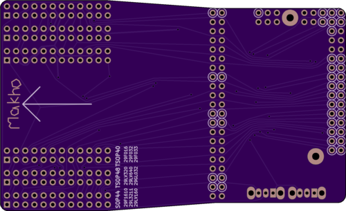
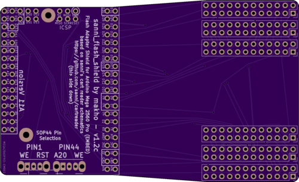

# 8 bit flash adapter

Version 1.2c renders

BOM:
(todo)
lots of pin headers, two more SPDT switches that you used to build the control unit (only required for the SOP adapter), and then the adapters themselves. 

[assembly video here (soon)](https://youtu.be/Xz5Vwh5hB-U)
