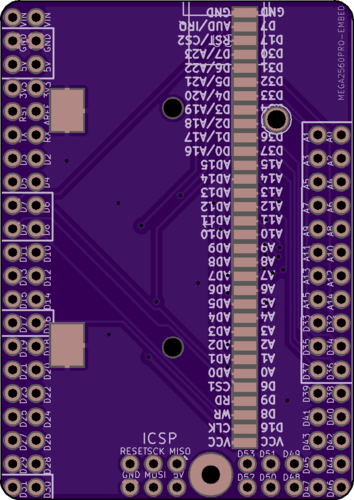
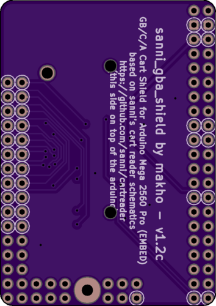

# game boy game pak adapter

Version 1.2c renders

BOM:

[the cart slot](https://www.aliexpress.com/item/For-Nintendo-DS-NDSL-GBA-Game-Cartridge-Card-Reader-Slot-Repair-Part/32679592016.html) and then some header pins (you can use the ones that came with the arduino)
