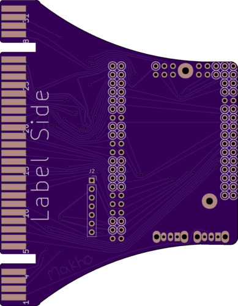
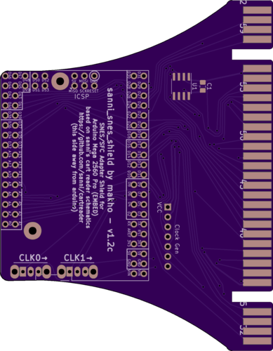

# snes / sfc adapter

Version 1.2c renders

this is a work in progress. This is currently tested and confirmed working but some things are in dumb spots. I kinda just winged this whole thing.

BOM:
(todo)
The cart slot, CIC lock hardware, clock signal generator, two more of the SPDT switches that you used for the control unit, and probably something else that I'm forgetting. 
