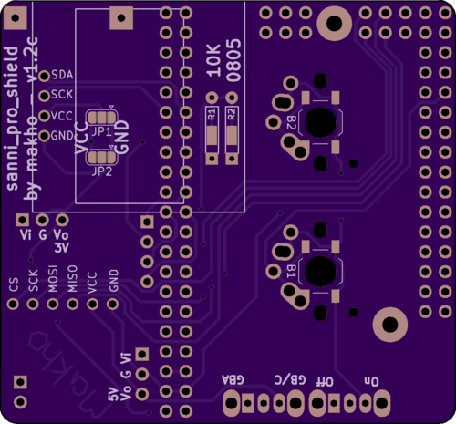
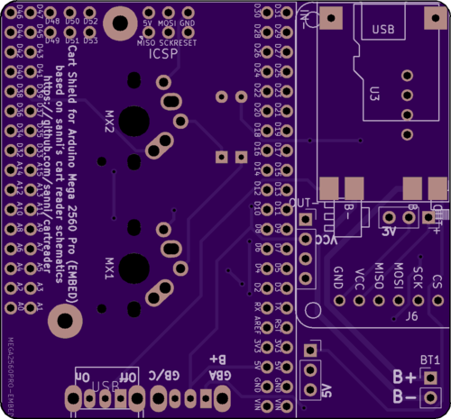

# control unit

Version 1.2c renders

BOM: 

|Part Desc|Link|Alternative Link|Cost (I used)|Notes|
:--|:--|:--|--:|:--|
|Arduino Mega 2560 Pro (EMBED, NOT MINI)|[https://www.aliexpress.com/item/MEGA-2560-PRO-Embed-CH340G-ATMEGA2560-16AU-Chip-With-Male-Pinheaders-Compatible-for-Arduino-Mega2560-Module/32968779271.html](https://www.aliexpress.com/item/MEGA-2560-PRO-Embed-CH340G-ATMEGA2560-16AU-Chip-With-Male-Pinheaders-Compatible-for-Arduino-Mega2560-Module/32968779271.html)|[https://www.aliexpress.com/item/Mega-2560-PRO-Embed-CH340G-ATmega2560-16AU-with-male-pinheaders-Compatible-for-Arduino-Mega-2560/32801785024.html](https://www.aliexpress.com/item/Mega-2560-PRO-Embed-CH340G-ATmega2560-16AU-with-male-pinheaders-Compatible-for-Arduino-Mega-2560/32801785024.html)|$8.60|I’d recommend the RobotDyn version. I’ve purchased four of these modules so far and two RobotDyn units were fine, one off-brand unit was fine while the other was DOA.|
|2x10K 0805 SMT Resistors|https://www.aliexpress.com/item/100Pcs-0805-SMD-1-4W-0R-10M-chip-resistor-0-10R-100R-220R-330R-470R-1K/32858225842.html| |$0.59|Might as well keep these things handy, they are useful for a lot of DIY type things. The board supports through-hole type resistors as well but I’d recommend the surface-mount ones anyway.|
|2x SMT SPST Push Button (OR mech keyboard switch)|https://novelkeys.xyz/collections/switches/products/novelkeys-x-kailh-low-profile-choc-thick-clicks|[https://www.aliexpress.com/item/UXCELL-50PCS-5x5x3mm-Momentary-Panel-PCB-SMD-SMT-Mount-4-Pins-Push-Button-SPST-Tactile-Tact/32959353697.html](https://www.aliexpress.com/item/UXCELL-50PCS-5x5x3mm-Momentary-Panel-PCB-SMD-SMT-Mount-4-Pins-Push-Button-SPST-Tactile-Tact/32959353697.html)|$2.55|I opted for mech keys that I already had on hand. The board supports Cherry MX (or equivalent), Alps (or equivalent), or Kailh Choc. You can also use 6x6 buttons but you’ll have to fold the legs under the button and solder from the side. Additionally, if you use standard tact switches, you want to make sure that the buttons you use stick out a few MM since it’s a bit of a pain in the rear to use them otherwise.|
|2x THT SPDT Slide Switch|https://www.aliexpress.com/item/50PCS-YT1998Y-SK12D07-Toggle-Switch-3Pin-PCB-2-Position-1P2T-SPDT-Miniature-Slide-Switch-Side-Knob/32827322833.html| |$1.75|You only need two of the 50, but I can’t find any smaller quantities for less. If you’ve already built one of Sanni’s cart reader shields, you probably already have these.|
|RGB LED (Common Anode)|[https://www.aliexpress.com/item/20Pcs-Multicolor-4pin-5mm-RGB-Led-Diode-Light-Lamp-Tricolor-Round-Common-Anode-LED-F5-Light/32852334348.html](https://www.aliexpress.com/item/20Pcs-Multicolor-4pin-5mm-RGB-Led-Diode-Light-Lamp-Tricolor-Round-Common-Anode-LED-F5-Light/32852334348.html)|https://www.ebay.com/itm/291548934125|$0.88|You only need one of the 50. Enjoy finding uses for the other 49. You can also omit this entirely.|
|OLED Screen|[https://www.aliexpress.com/item/0-96-inch-IIC-Serial-White-OLED-Display-Module-128X64-I2C-SSD1306-12864-LCD-Screen-Board/32896971385.html](https://www.aliexpress.com/item/0-96-inch-IIC-Serial-White-OLED-Display-Module-128X64-I2C-SSD1306-12864-LCD-Screen-Board/32896971385.html)| |$2.25|Comes in blue or white. Take your pick. I like the white.|
|TP4056 Charge Module with Low Voltage Protection|https://www.aliexpress.com/item/Free-Shipping-5V-1A-Micro-USB-18650-Lithium-Battery-Charging-Board-Charger-Module-Protection-Dual/32453058256.html| |$0.85|Micro USB variant is cheaper but this is your charge port and you can use Mini USB or USB C if you like. As long as you get the protected version, the footprint should match.|
|702540 Cell|[https://www.aliexpress.com/item/32878325857.html](https://www.aliexpress.com/item/32878325857.html)| |$8.00|Any “Game Boy Micro” sized battery should fit perfectly within the space between the actual cart interface shield and the arduino. If you have something laying around, that’s even better as this is the second most expensive part of the build (well, third depending on the PCBs)|
|5v 0.45A Voltage Regulator|[https://www.aliexpress.com/item/32786144773.html](https://www.aliexpress.com/item/32786144773.html)| |$1.54|A regulator that can handle more current would be better but this one is well within spec for Game Boy Games. SNES will require supplementary hardware. Any other three pin regulator should work, just mind that the PCB is expecting the middle pin to be ground.|
|3.3v 0.59A Voltage Regulator|[https://www.aliexpress.com/item/32914681832.html](https://www.aliexpress.com/item/32914681832.html)| |$1.47|Any three pin regulator should work, just mind that the middle pin is ground|
|Micro SD Module|[https://www.aliexpress.com/item/1PCS-Micro-SD-Storage-Expansion-Board-Mciro-SD-TF-Card-Memory-Shield-Module-SPI-For-Arduino/32523546123.html](https://www.aliexpress.com/item/1PCS-Micro-SD-Storage-Expansion-Board-Mciro-SD-TF-Card-Memory-Shield-Module-SPI-For-Arduino/32523546123.html)| |$1.04|This hardware does not support the full size SD Module (but only because I did not include the pins -- electrically, it should work fine).|
|Battery gauge (volt meter panel)|[https://www.aliexpress.com/item/32851937196.html](https://www.aliexpress.com/item/32851937196.html)| |$0.85|This is completely optional, but I like it. I also designed the PCB with this in mind so there will be an empty spot if you omit it.|
||||||
|2.54 MM Headers||||You only need the sockets if you think you might want to take this apart at some point. The sockets are required if you want to do more than rip whatever shield you assemble this with. XL pins are recommended for socket-less builds (not tested or linked).|
| Pins|https://www.aliexpress.com/item/10PCS-40Pin-1x40P-Male-Breakable-Pin-Header-Strip-2-54mm-Long-Blue-Red-White-Green-Yellow/32863408765.html| |$0.55|I had a ton of these laying around. With the pins, you can just break off however many you need and solder those on. You can also double-stack them pretty easily for things like the Arduino. The Arduino probably already came with pins though.|
| Sockets|[https://www.aliexpress.com/item/32889916876.html](https://www.aliexpress.com/item/32889916876.html)| |$4.32|You’ll need to get the 2x3, 2x16, and 2x20 option to socket the Arduino. I do not recommend socketing any other components on this model.|
|Total|||$36.79|Prices may have changed on somethings or shipping may be more or less expensive to your area.|

Please let me know if any parts go out of stock or if the listing disappears so that I can add an alternative. 

Assembly must be completed in order. Due to the close proximity of the parts, flush cutters are required and kapton tape for insulation is *highly* recommended. [Please see my video for an example of assembly.](https://youtu.be/GbIMFZ5j5U0)
